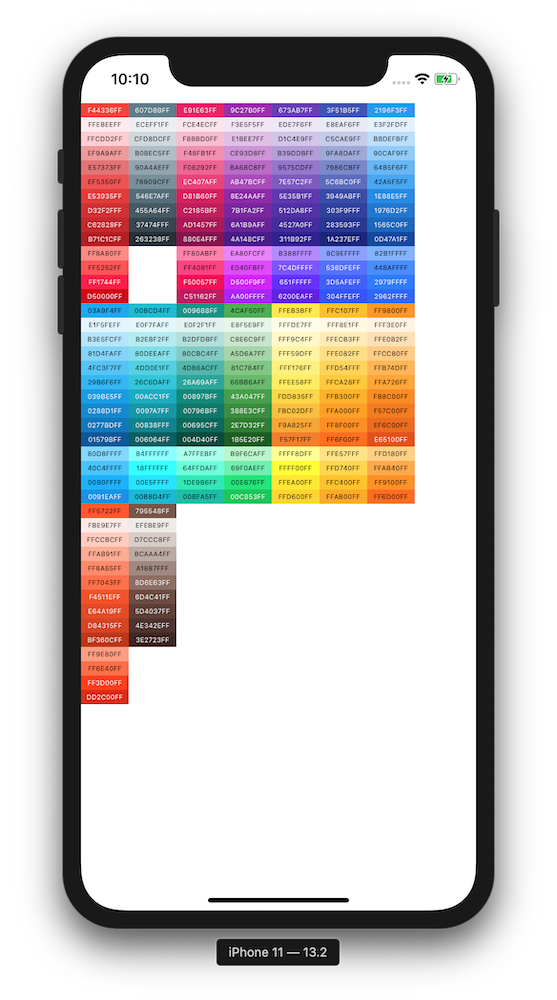

# Material-Colors
Material design colors for use in iOS projects

To make colors enumerable, I've created arrays of colors. It's not close to the same thing, but it's still useful if you want to loop over properties of a certain color. 

## Example of looping through the reds.

    var posY: CGFloat = 50.0
    for color in mc_reds {
        let box = Sliver(frame: CGRect(x: 0, y: posY, width: 50, height: 15), 
            background: color, useLabel: true)
        self.view.addSubview(box)
        posY += 15.0
    }
    
## Simple example of direct use.

    let myRed = MaterialColor.Red.RedDarken_2
    myView.backgroundColor = myRed
    

## Example of the project application running in a simulator.

